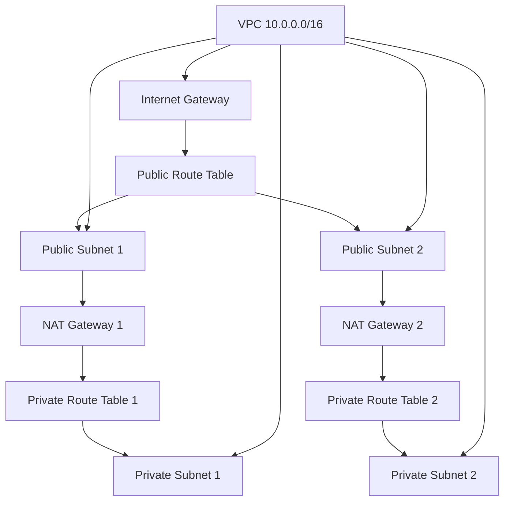
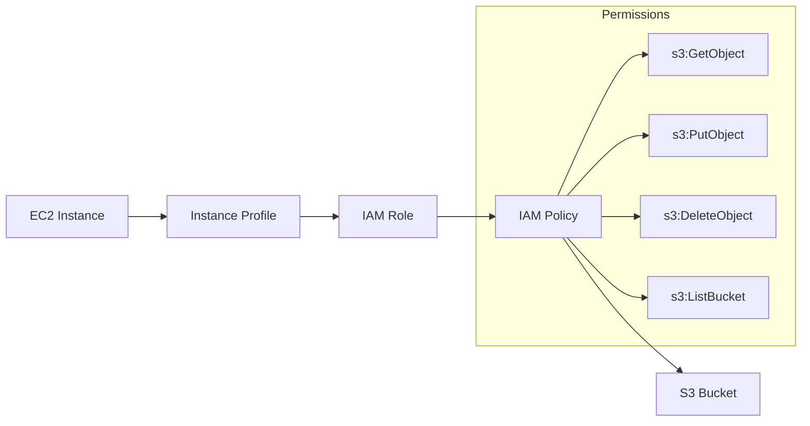
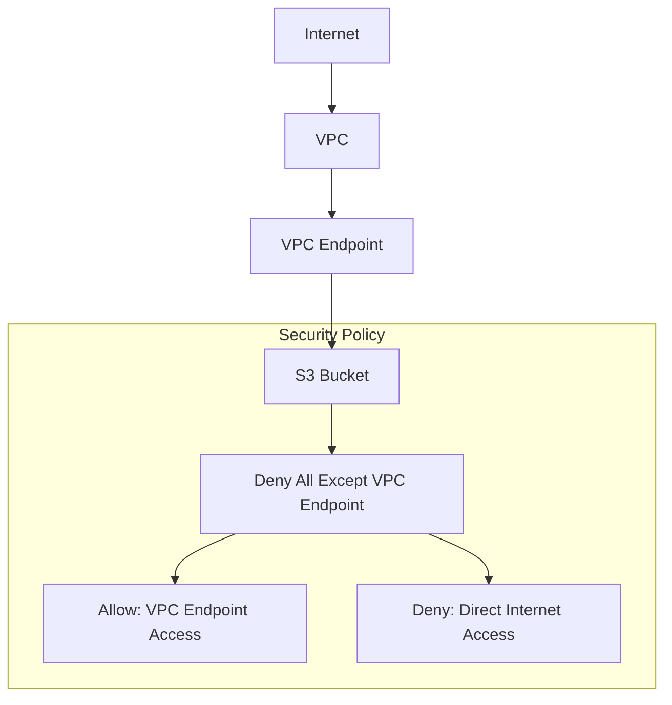
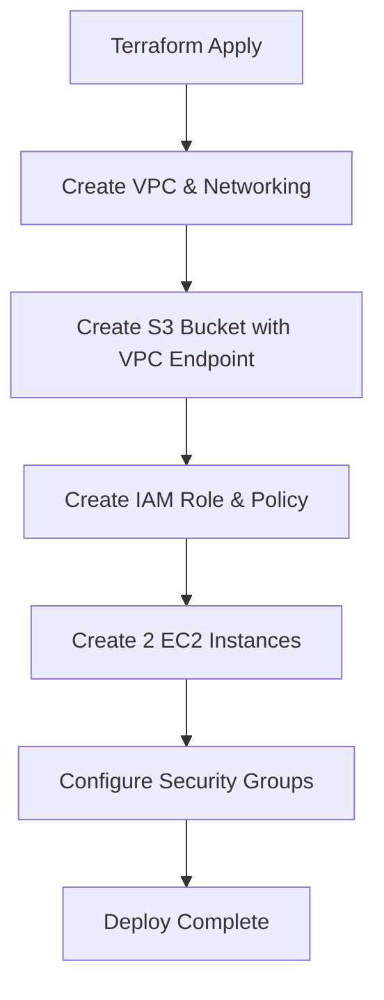
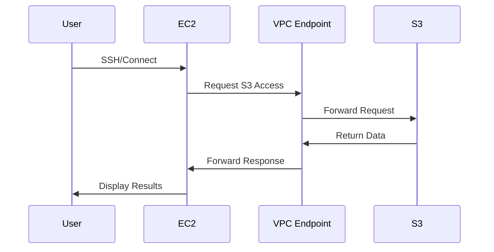

# 🏗️ Terraform Lab3 - Complete Guide

## 📋 Overview
This is a **Terraform infrastructure project** that creates AWS resources in a modular way. Think of it as a blueprint for building a small cloud infrastructure with:
- **2 EC2 instances** (virtual servers)
- **1 S3 bucket** (file storage)
- **VPC networking** (private network)
- **Security** (IAM roles and policies)

## 🗂️ Project Structure

```
lab3/
├── main.tf              # Main configuration file
├── variables.tf         # Input variables
├── outputs.tf          # Output values
├── providers.tf        # AWS provider configuration
├── backend.tf          # State storage configuration
└── modules/            # Reusable components
    ├── vpc/            # Virtual Private Cloud module
    ├── ec2/            # EC2 instances module
    └── s3/             # S3 bucket module
```

## 🔧 Core Files Explained

### 1. `main.tf` - The Master Controller
```terraform
# This file orchestrates everything
module "s3" {
  source = "./modules/s3"
  bucket_name     = var.s3_bucket_name
  vpc_endpoint_id = aws_vpc_endpoint.s3.id
  tags            = var.common_tags
}
```
**What it does:**
- **Line 4-10**: Creates S3 module with bucket name, VPC endpoint, and tags
- **Line 13-15**: Gets information about your existing subnet
- **Line 18-20**: Gets all route tables for the VPC
- **Line 23-32**: Creates VPC endpoint for S3 (allows private access to S3)
- **Line 35-45**: Creates EC2 module with S3 permissions

### 2. `variables.tf` - Configuration Settings
```terraform
variable "aws_region" {
  description = "AWS region"
  type        = string
  default     = "ap-south-1"
}
```
**What it does:**
- Defines all configurable values
- Sets defaults (like region, instance type, etc.)
- Makes the code reusable and flexible

### 3. `outputs.tf` - Results Display
```terraform
output "ec2_instance_ids" {
  description = "IDs of the EC2 instances"
  value       = module.ec2.instance_ids
}
```
**What it does:**
- Shows important information after deployment
- Displays instance IDs, IP addresses, bucket names

### 4. `backend.tf` - State Management
```terraform
terraform {
  backend "s3" {
    bucket         = "your-terraform-state-bucket"
    key            = "terraform.tfstate"
    region         = "ap-south-1"
    encrypt        = true
    dynamodb_table = "terraform-state-lock"
  }
}
```
**What it does:**
- Stores Terraform state in S3 (not locally)
- Prevents conflicts when multiple people work on same project
- Enables state locking with DynamoDB

## 🏗️ Modules Deep Dive

### VPC Module (`modules/vpc/`)

#### `main.tf` - Network Foundation
```terraform
resource "aws_vpc" "main" {
  cidr_block           = var.vpc_cidr
  enable_dns_hostnames = true
  enable_dns_support   = true
}
```

**What it creates:**
1. **VPC** (Virtual Private Cloud) - Your private network
2. **Internet Gateway** - Gateway to the internet
3. **Public Subnets** - Can access internet directly
4. **Private Subnets** - Access internet through NAT Gateway
5. **NAT Gateways** - Allows private subnets to access internet
6. **Route Tables** - Traffic routing rules

#### Network Architecture Diagram


### EC2 Module (`modules/ec2/`)

#### `EC2.tf` - Virtual Servers
```terraform
resource "aws_instance" "terra-1stlab" {
  ami                    = data.aws_ami.ubuntu.id
  count                  = 2
  instance_type          = var.instance_type
  key_name              = var.key_name
  subnet_id             = var.subnet_id
  vpc_security_group_ids = [var.security_group_id]
  iam_instance_profile   = aws_iam_instance_profile.ec2_profile.name
}
```

**What it creates:**
1. **2 EC2 instances** running Ubuntu
2. **IAM Role** - Permissions for EC2 to access S3
3. **IAM Policy** - Specific S3 permissions
4. **Instance Profile** - Links role to EC2 instances

#### Security Flow Diagram


### S3 Module (`modules/s3/`)

#### `S3.tf` - File Storage
```terraform
resource "aws_s3_bucket" "terra-lab2-bucket" {
  bucket = var.bucket_name
  tags = merge(var.tags, {
    Name        = var.bucket_name
    project     = "terraform"
    Environment = var.environment
  })
}
```

**What it creates:**
1. **S3 Bucket** - File storage container
2. **Bucket Policy** - Security rules (only accessible via VPC endpoint)

#### S3 Security Diagram


## 🔄 How Everything Works Together

### 1. **Infrastructure Flow**


### 2. **Data Flow**


## 🚀 How to Use This Project

### Prerequisites
- AWS CLI configured
- Terraform installed
- Valid AWS credentials

### Commands
```bash
# Initialize Terraform
terraform init

# Plan the deployment
terraform plan

# Deploy the infrastructure
terraform apply

# View outputs
terraform output

# Destroy everything
terraform destroy
```

## 🔐 Security Features

1. **VPC Endpoint**: S3 access only through private network
2. **IAM Roles**: Least privilege access (only S3 permissions needed)
3. **Private Subnets**: EC2 instances in private network
4. **Bucket Policy**: Denies public access, only allows VPC endpoint access

## 📊 Key Benefits

- **Modular Design**: Easy to reuse and maintain
- **Secure**: Private network access only
- **Scalable**: Easy to add more instances
- **Cost-Effective**: Uses t2.micro instances
- **State Management**: Remote state with locking

## 🎯 What Each File Does (Quick Reference)

| File | Purpose |
|------|---------|
| `main.tf` | Orchestrates all modules |
| `variables.tf` | Configuration parameters |
| `outputs.tf` | Shows results after deployment |
| `providers.tf` | AWS provider configuration |
| `backend.tf` | Remote state storage |
| `modules/vpc/main.tf` | Creates network infrastructure |
| `modules/ec2/EC2.tf` | Creates virtual servers |
| `modules/s3/S3.tf` | Creates file storage |

## 🔍 Troubleshooting

- **State locked**: Check if another user is running Terraform
- **Permission denied**: Verify AWS credentials and IAM permissions
- **Resource already exists**: Check if resources were created outside Terraform
- **Module not found**: Run `terraform init` to download modules

This project demonstrates **Infrastructure as Code** best practices with proper security, modularity, and state management! 🎉